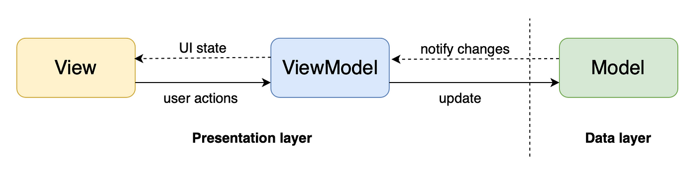

<h1 align="center">Fitstyle</h1>

<p align="center">
    
  
  <a href="https://opensource.org/licenses/Apache-2.0"></a>
</p>

<p align="center">Fitstyle is an app that allows users to merge photos and art to create styled images. This app showcases modern iOS development with Swift, SwiftUI, Combine Framework, Core Data and an MVVM architecture.</p>

<p align="center">

</p>

## Tech stack 
- [SwiftUI](https://developer.apple.com/xcode/swiftui/) A modern declarative framework for building user interfaces.
- [Combine](https://developer.apple.com/documentation/combine): A framework for handling asynchronous events and data flow.
- [Core Data](https://developer.apple.com/documentation/coredata): A data persistence framework that facilitates data storage, retrieval, and management.
- Architecture:
  - MVVM Architecture (View - ViewModel - Model): Facilitates separation of concerns and promotes maintainability.
- [Alamofire](https://github.com/Alamofire/Alamofire): A Swift network library for handling API requests and responses.
- [Kingfisher](https://github.com/onevcat/Kingfisher): An lightweight Swift library for loading and caching images.
- [AWS Amplify](https://github.com/aws-amplify/amplify-iOS): An Swift library that facilitates interaction with AWS services. 

## Architecture
**Fitstyle** adopts the MVVM architecture which consists of the presentation and data layer.


- The presentation layer is made of up of the View and ViewModel: 
  - **View**: The view is built with SwiftUI and is responsible for the layout and appearance of the app. It reflects the state provided by the ViewModel.
  - **ViewModel**: The ViewModel acts as an intermediary between the Model and the View. It handles the presentation logic and state management, exposing data in a format suitable for the View.
- The data layer consists of the **Model** which is responsible for managing the application data and contains the business logic. 

## Requirements
- iOS 15.5+
- Xcode 12.0+
- Swift 5.3+

# License
```xml
Designed and developed by 2024 gojoel (Joel Goncalves)

Licensed under the Apache License, Version 2.0 (the "License");
you may not use this file except in compliance with the License.
You may obtain a copy of the License at

   http://www.apache.org/licenses/LICENSE-2.0

Unless required by applicable law or agreed to in writing, software
distributed under the License is distributed on an "AS IS" BASIS,
WITHOUT WARRANTIES OR CONDITIONS OF ANY KIND, either express or implied.
See the License for the specific language governing permissions and
limitations under the License.
```
